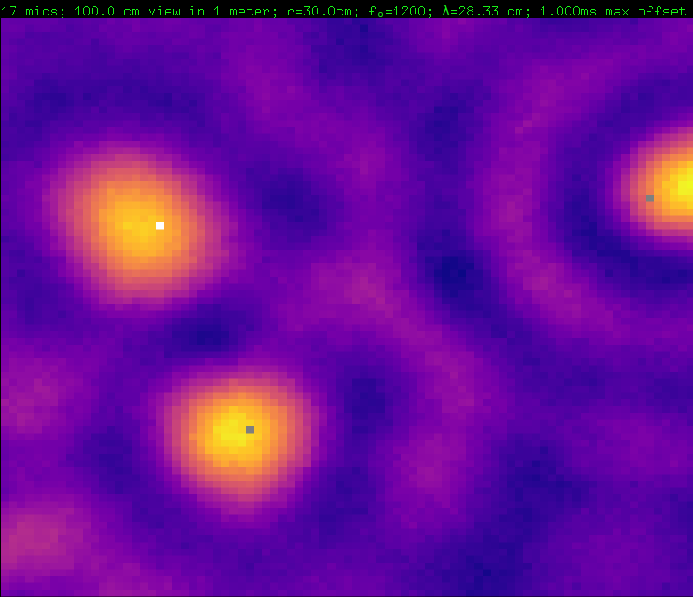

... just hacking. Nothing to see here.

- Position of sound source.
- Position of each microphone.
- Position of camera.
- duration of time.

- simulate ADC. Output a bunch of samples
  - output a stream of samples (timestamp, value)
  - simulate two ways:
    o sample hold in parallel
    o different ts for each microphone

- display angles -180 .. 180. Distance doesn't matter, right ?
- for every 5 degrees in each direction, do a 
- output everything as threejs ?

